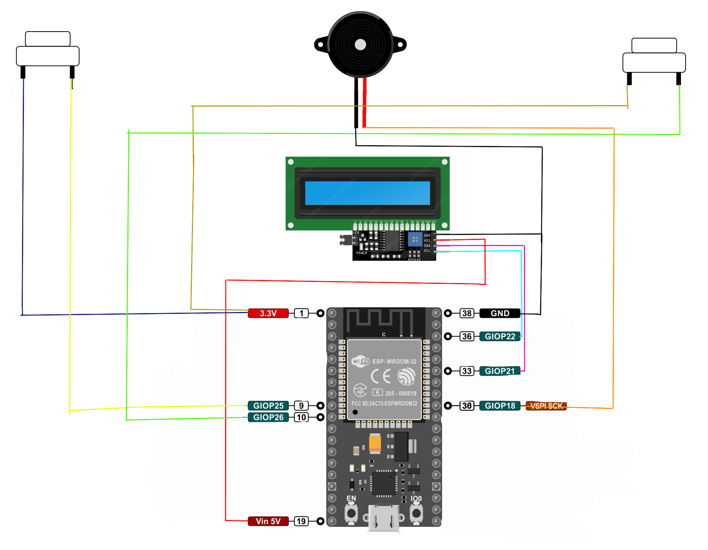

# Telegrafo Bluetooth

Este proyecto propone un método de comunicación alternativo a los sistemas de mensajería instantánea actuales basados en redes Wi-Fi. El enfoque adoptado se fundamenta en una arquitectura de comunicación peer-to-peer (P2P) mediante conexiones Bluetooth, eliminando así la dependencia de infraestructuras de red centralizadas o acceso a Internet.

Como mecanismo de codificación de los mensajes se ha optado, por simplicidad, por el uso del código Morse, lo que permite representar caracteres de forma binaria mediante secuencias temporizadas de señales (pulsos y pausas). Esta elección facilita tanto la implementación como el análisis del sistema, especialmente en entornos embebidos o con recursos limitados.

Dado que la comunicación por Bluetooth está sujeta a restricciones físicas de distancia, el alcance actual del sistema es limitado. No obstante, el diseño es potencialmente escalable en entornos con alta densidad de dispositivos, mediante la implementación de un modelo de red distribuida en el que cada nodo actúe como repetidor o intermediario. Esta estrategia permitiría extender el alcance de los mensajes sin necesidad de infraestructura adicional, formando así una red tipo mesh Bluetooth.

## Autores 
 - Dario Acuña Soutullo
 - Javier Gonzales Velazquez

# Características del sistema

- Microcontrolador ESP32: Núcleo principal del sistema, que gestiona la lógica de comunicación, temporización y procesamiento de señales.

- Pantalla LCD 16x2 con interfaz I2C: Utilizada para mostrar los mensajes decodificados en tiempo real con un consumo mínimo de pines GPIO.

- Envío y recepción de mensajes vía Bluetooth: Comunicación inalámbrica directa entre dispositivos mediante tecnología Bluetooth en modo P2P.

- Distinción sonora entre pulsos cortos y largos: Emisión de sonidos diferenciados para representar las señales del código Morse (punto y raya), facilitando la interpretación y retroalimentación auditiva.

- Traducción instantánea de Morse a caracteres alfanuméricos: Decodificación automática de las secuencias Morse recibidas para su visualización textual.

- Tiempo de pausa configurable entre letras y palabras: Parámetros ajustables que permiten adaptar el ritmo de comunicación a las preferencias o necesidades del usuario.
## Tecnologías usadas

- Vscode (Visual Studio Code)
- FreeCAD
- PlatformIO
- Arduino IDE
- PuTTY
- Bluetooth 4.2 (BR/EDR y BLE)
- Comunicación I2c

## Directorios y Archivos

- **Esclavo:**
    - main.cpp
    - utilidades.cpp   
    - utilidades.h

- **Maestro:**
    - main.cpp
    - utilidades.cpp   
    - utilidades.h

- **Modelos CAD:** 
    - MainFrame.stl
    - Soporte_Bateria.stl
    - Tapa_derecha_trasera.stl
    - Tapa_izquierda_trasera.stl
      
Todas las roscas modeladas en los modelos cad son roscas M3 según el perfil regular métrtico ISO. Según la maquinaria que se use para la impresión o la fabricación de las partes o el material usado puede que el modelo final requiera de tornillos distintos de un M3. En este caso se usó una impresora 3D creality Ender3 y PLA, lo que resulto en el uso de tornillos M2.5 para el ensamblado final.
- **platformio.ini:** archivo de configuración para PlatformIO

## Observaciones
Para llevar a cabo el proyecto, es necesario modificar el código del dispositivo maestro, ya que la conexión Bluetooth entre las dos placas ESP32 se establece utilizando la dirección MAC del microcontrolador que actuará como esclavo.

Para obtener dicha dirección MAC, se puede hacer uso del archivo dir_mac.cpp, que permite identificar y mostrar la dirección única del dispositivo esclavo. Esta dirección debe ser incorporada en el código del maestro para establecer correctamente la conexión Bluetooth.

## Documentación
La Documentación consultada son las respectivas Datasheet de los componentes y las documentaciones de las librerías usadas:

**Componentes:** 

**[ESP32-Datasheet](https://www.espressif.com/sites/default/files/documentation/esp32_datasheet_en.pdf)**

**[LCD 1602A](https://www.openhacks.com/uploadsproductos/eone-1602a1.pdf)**

**[Buzzer](https://www.farnell.com/datasheets/2171929.pdf)**

**Librerias**

**[Arduino.h](https://www.arduino.cc/reference/en/):**  Librería base del framework de Arduino. Proporciona funciones fundamentales como pinMode, digitalWrite, millis, etc.

**[BluetoothSerial.h](https://github.com/espressif/arduino-esp32/tree/master/libraries/BluetoothSerial):** Librería específica para ESP32 que implementa el perfil SPP (Serial Port Profile) de Bluetooth clásico

**[Wire.h](https://www.arduino.cc/en/Reference/Wire):** Librería para comunicación I2C (Two Wire Interface). Usada para interactuar con sensores, pantallas, etc.

**[LiquidCrystal_I2C.h](https://github.com/johnrickman/LiquidCrystal_I2C):**  Librería para pantallas LCD (16x2, 20x4, etc.) con interfaz I2C basada en el chip PCF8574.

